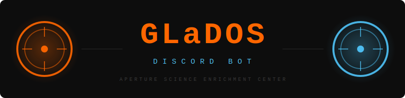

<div align="center">



### 🟠 &nbsp; Aperture Science Voice Interaction Module &nbsp; 🔵

*"Weeell, how are you holding up? Because I'M A DISCORD BOT."*

[](https://docs.docker.com/compose/)
[](https://nodejs.org/)
[](https://python.org/)
[](https://ollama.com/)
[](LICENSE)
[](https://github.com/nurdie/dLaDOS)

</div>

---

A self-hosted Discord voice bot that drags **GLaDOS from Portal** into your server — complete with her iconic sardonic personality, real voice synthesis, and live conversation powered by a local LLM.

No cloud APIs. No subscriptions. No cake.

> 🔬 Voice synthesis powered by **[dnhkng/GlaDOS](https://github.com/dnhkng/GlaDOS)** — a remarkable open-source project that recreates GLaDOS's voice using custom-trained TTS models. This bot is a Discord frontend for that engine. All credit for the voice model and TTS pipeline belongs there. Please star it.

---

## 🧪 Features

| | |
|---|---|
| 🎙️ | Joins your voice channel and holds a **real conversation** |
| 🤖 | Responds in **GLaDOS's actual voice** via the GlaDOS TTS engine |
| 🧠 | Remembers recent conversation history per session |
| ✋ | Interrupt GLaDOS mid-sentence and she'll stop talking |
| 🔒 | **Fully local** — no OpenAI, no ElevenLabs, no cloud dependency |
| 🚪 | Say **"go away GLaDOS"** or **"please leave"** to end the session |

---

## ⚙️ Architecture

*The Enrichment Center is required to remind you that the following test may involve the following elements:*

```
🎤 Discord user speaks
        │  Opus @ 48 kHz
        ▼
┌─────────────────────────────────────┐
│  🟠  bot  (bot.js)                  │  Node.js · discord.js v14
│       Captures audio, drives the    │  @discordjs/voice + DAVE E2EE
│       conversation loop             │
└─────────────┬───────────────────────┘
              │  MP3 @ 16 kHz (HTTP multipart)
              ▼
┌─────────────────────────────────────┐
│  🎧  whisper  (port 9000)           │  faster-whisper + FastAPI
│       Speech-to-text                │  Model loaded once at startup
│       ~4× faster than openai-whisper│
└─────────────┬───────────────────────┘
              │  transcript text
              ▼
┌─────────────────────────────────────┐
│  🧠  ollama  (port 11434)           │  Local LLM (qwen2.5, llama3.2, …)
│       Generates GLaDOS's response   │  OpenAI-compatible API
└─────────────┬───────────────────────┘
              │  GLaDOS response text (HTTP)
              ▼
┌─────────────────────────────────────┐
│  🔵  voice  (port 5050)             │  dnhkng/GlaDOS TTS engine
│       Text → GLaDOS's voice         │  Cloned from GitHub at build time
└─────────────┬───────────────────────┘
              │  MP3 → FFmpeg → PCM @ 48 kHz stereo
              ▼
        🔊 Voice channel playback
```

**Why a separate Whisper container?**
The original approach spawned a Python subprocess per transcription, loading the Whisper model from disk on every request. The dedicated `whisper` service loads the model once at startup and serves subsequent requests over HTTP — cutting per-request latency from several seconds down to actual inference time.

---

## 📋 Prerequisites

- **Docker** and **Docker Compose** v2
- A **Discord bot token** ([create one here](https://discord.com/developers/applications))
- Bot permissions required in your server:
  - `Connect` and `Speak` in voice channels
  - `Use Application Commands` (slash commands)
  - `Send Messages` (for ephemeral replies)
- Sufficient RAM for the chosen models (see [Choosing Models](#choosing-models))
- **GPU (optional but recommended):**
  - AMD: ROCm-capable GPU with `/dev/kfd` exposed (auto-detected by `run.sh`)
  - NVIDIA: `nvidia-container-toolkit` installed on the host (auto-detected by `run.sh`)
  - Raspberry Pi: auto-detected — runs CPU with ARM64 images and memory limits tuned for Pi. Raspberry Pi 5 recommended for acceptable inference speed
  - CPU-only fallback works on any x86-64 host but inference will be slow

> **ARM64 (Apple Silicon / Raspberry Pi):** Docker builds natively. On x86-64, set `DOCKER_DEFAULT_PLATFORM=linux/amd64` before running `./run.sh`.

---

## 🚀 Quick Start

### 1. Clone

```bash
git clone https://github.com/nurdie/dLaDOS.git
cd dLaDOS
```

The GLaDOS TTS engine is cloned automatically at build time — no submodules needed.

### 2. Configure

```bash
cp .env.example .env
```

Edit `.env` and set at minimum:

```env
DISCORD_TOKEN=your-discord-bot-token-here
```

See [Configuration](#%EF%B8%8F-configuration) for all options.

### 3. Start

```bash
./run.sh up --build
```

`run.sh` detects your GPU vendor (AMD/NVIDIA/CPU) and passes the right Docker Compose overlay automatically. All services start together — the bot waits for the others to be healthy before connecting. On first run, the `voice` container downloads TTS model weights (~2–4 GB) into a Docker volume — this only happens once.

> **Manual override:** `docker compose -f docker-compose.yml -f docker-compose.amd.yml up --build`

### 4. Summon GLaDOS

<div align="center">

| Command | Description |
|:---:|:---|
| 🟠 `/glados join` | Join your voice channel and start a conversation |
| 🤖 `/glados ask <prompt>` | Send a typed prompt through the LLM and speak the response |
| 🔵 `/glados say <text>` | Speak text directly via TTS — no LLM, instant playback |
| 🚪 `/glados leave` | Disconnect the bot |

</div>

Say **"go away GLaDOS"** or **"please leave"** in voice to end the session naturally.

---

## 🛠️ Configuration

Copy `.env.example` to `.env` and edit. Full reference in [`.env.example`](.env.example).

| Variable | Default | Description |
|---|---|---|
| `DISCORD_TOKEN` | *(required)* | Your Discord bot token |
| `WHISPER_MODEL` | `base` | Whisper model size: `tiny` `base` `small` `medium` `large` |
| `OLLAMA_MODEL` | `qwen2.5:0.5b-instruct` | LLM model tag (must be pulled in Ollama) |
| `OLLAMA_MAX_TOKENS` | `80` | Keep low for snappy TTS (60–100 is the sweet spot) |
| `TTS_VOICE` | `glados` | Voice name passed to the TTS engine |
| `MAX_CONVERSATION_CHARS` | `6000` | Per-session history budget; older messages are dropped |
| `GLADOS_SYSTEM_PROMPT` | *(built-in)* | Override the GLaDOS personality prompt |
| `GLADOS_REF` | `main` | Branch/tag/SHA of dnhkng/GlaDOS to build against |

---

## 🧬 Choosing Models

*The Enrichment Center wishes you the best of luck. We do what we must because we can.*

### 🧠 LLM (Ollama)

| Model | RAM | Notes |
|---|:---:|---|
| `qwen2.5:0.5b-instruct` | ~1 GB | Default; good for testing |
| `qwen2.5:3b-instruct` | ~2 GB | **Recommended** for daily use |
| `llama3.2:3b` | ~2 GB | Good alternative |
| `qwen2.5:7b-instruct` | ~5 GB | Better quality; needs 8+ GB RAM |

```bash
docker exec ollama ollama pull qwen2.5:3b-instruct
```

### 🎧 Whisper (ASR)

| Model | RAM | Notes |
|---|:---:|---|
| `tiny` | ~400 MB | Fastest |
| `base` | ~500 MB | Default; best balance |
| `small` | ~1 GB | **Recommended** if you have RAM |
| `medium` | ~3 GB | Best practical accuracy |

```bash
# Set WHISPER_MODEL=small in .env, then:
./run.sh up --build whisper
```

---

## 🔧 Development

### Running without Docker

```bash
cd bot
npm install
python3 -m venv .venv && .venv/bin/pip install -r requirements.txt
cp ../.env.example ../.env  # edit as needed
node src/bot.js
```

You'll need a reachable Ollama instance and GLaDOS TTS service. Point `OLLAMA_ENDPOINT` and `TTS_ENDPOINT` at them. Leave `WHISPER_ENDPOINT` unset to fall back to in-process transcription (slow; loads openai-whisper locally).

### Pinning the GLaDOS TTS version

```bash
GLADOS_REF=v1.2.3 ./run.sh build voice
```

### Logs

Conversation prompts are appended to `logs/glados-prompts.log` inside the bot container (`[ISO timestamp] [mode] [guild] [user] prompt`).

---

## 🤝 Contributing

See [CONTRIBUTING.md](CONTRIBUTING.md).

---

## 💛 Acknowledgements

- **[dnhkng/GlaDOS](https://github.com/dnhkng/GlaDOS)** by [@dnhkng](https://github.com/dnhkng) — the open-source GLaDOS voice engine that does the actual heavy lifting. The `voice` container is simply this project running in API mode. All credit for the voice model, TTS pipeline, and GLaDOS personality work belongs there. Please star it.
- **[Ollama](https://ollama.com)** — makes running local LLMs dead simple.
- **[faster-whisper](https://github.com/SYSTRAN/faster-whisper)** — ~4× faster than openai-whisper with lower memory usage.

---

## 📄 License

MIT — see [LICENSE](LICENSE).

The GLaDOS TTS engine ([dnhkng/GlaDOS](https://github.com/dnhkng/GlaDOS)) is a separate project with its own license. This bot does not redistribute any part of that codebase — it is fetched at build time directly from its upstream repository.

---

<div align="center">

*"Goodbye. I'm going to go build a supervillain bot in the corner."*

🟠 &nbsp;&nbsp;&nbsp; 🔵

</div>
